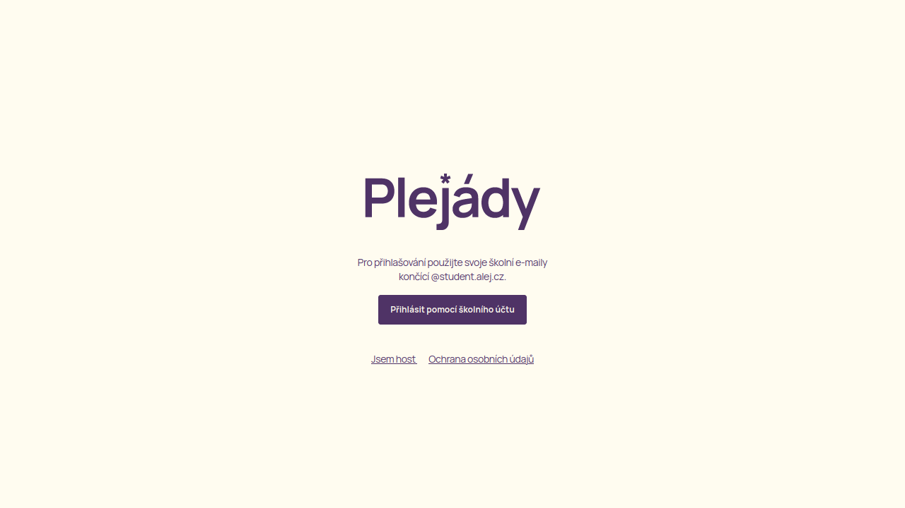
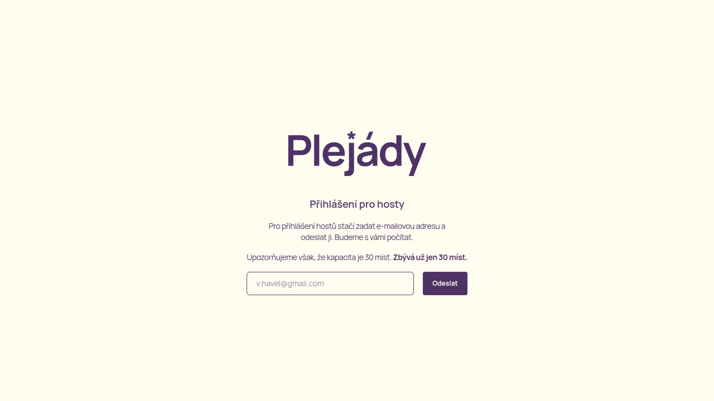
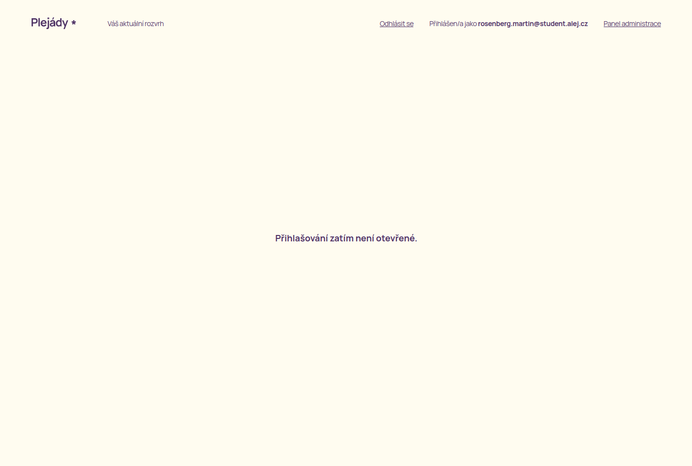

# Uživatelská příručka aplikace Plejády

Vítejte, uživateli! Tato příručka vám pomůže s používáním aplikace Plejády, ať už jste běžný uživatel, nebo administrátor systému, který chce aplikaci na přednáškový den připravit.

Pokud máte jakékoli připomínky, obraťte se, prosím na [tento e-mail](mailto:nitram.rosenberg@gmail.com).

## Před přihlášením

Takto vypadá hlavní stránka aplikace před přihlášením. Nachází se zde dvě důležitá tlačítka:

  * Jsem host
  * Přihlásit pomocí školního účtu

Na Plejády nemohou sice chodit hosté z řad široké veřejnosti, ale vstup absolventům gymnázia je povolený. Právě ti se mohou přihlásit pomocí tlačítka *Jsem host*. Takto přihlášení uživatelé si přednášky nevybírají – eviduje se pouze počet těchto hostů, aby se mohlo počítat s jejich počtem. Přednášky si vyberou přímo na místě konání. Počet hostů je omezený – tento počet je nastavitelný v administračním systému.

---

Pokud je uživatel student, může se svým školním e-mailem přihlásit pomocí tlačítka *Přihlásit pomocí školního účtu*. Tito uživatelé se tak dostanou do aplikace a při spuštění přihlášení si mohou vybrat přednášky. Systém vybírání přednášek funguje na jednoduchém principu – kdo dřív přijde, ten dřív mele. Detaily tohoto principu jsou popsány níže.

## Po přihlášení

Po úspěšném příhlášení se dostanete na stránku podobnou této. Vzhledem k tomu, že přihlašování zatím nejspíš není otevřené, nezobrazí se Vám tabulka s přednáškami. V horní části obrazovky na odhlášení a, pokud jste administrátor, na tlačítko na administraci systému.

Pokud již administrátoři nastavili čas spuštění přihlašování, zobrazí se Vám na hlavní stránce, abyste věděli, kdy se na stránku dostavit a vybrat si své přihlášky.

---

TODO: Doplnit obrázek

Poté co se přihlašování spustí, zobrazí se Vám tabulka s přednáškami. U každé přednášky uvidíte detaily o ní a také to, jak moc je zaplněná. Kapacita přednášky se mění v reálném čase, tudíž v každý okamžik vidíte, kolik je volných míst. Po zaplnění všech míst se přednáška zatmaví a už na ni není možné kliknout.
