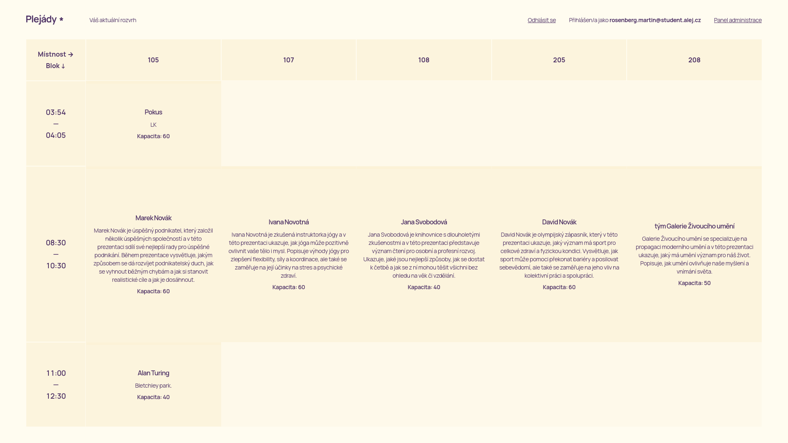
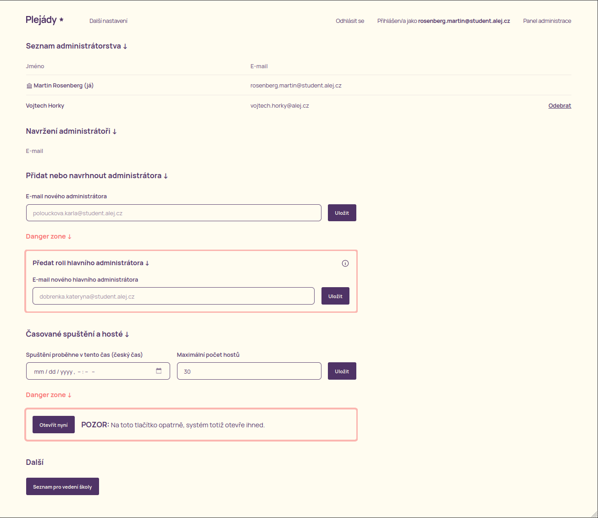

# Uživatelská příručka aplikace Plejády

Vítejte, uživateli! Tato příručka vám pomůže s používáním aplikace Plejády, ať už jste běžný uživatel, nebo administrátor systému, který chce aplikaci na přednáškový den připravit.

Pokud máte jakékoli připomínky, obraťte se, prosím na [tento e-mail](mailto:nitram.rosenberg@gmail.com).

## Před přihlášením

Takto vypadá hlavní stránka aplikace před přihlášením. Nachází se zde dvě důležitá tlačítka:

  * Jsem host
  * Přihlásit pomocí školního účtu

Na Plejády nemohou sice chodit hosté z řad široké veřejnosti, ale vstup absolventům gymnázia je povolený. Právě ti se mohou přihlásit pomocí tlačítka *Jsem host*. Takto přihlášení uživatelé si přednášky nevybírají – eviduje se pouze počet těchto hostů, aby se mohlo počítat s jejich počtem. Přednášky si vyberou přímo na místě konání. Počet hostů je omezený – tento počet je nastavitelný v administračním systému.

---

Pokud je uživatel student, může se svým školním e-mailem přihlásit pomocí tlačítka *Přihlásit pomocí školního účtu*. Tito uživatelé se tak dostanou do aplikace a při spuštění přihlášení si mohou vybrat přednášky. Systém vybírání přednášek funguje na jednoduchém principu – kdo dřív přijde, ten dřív mele. Detaily tohoto principu jsou popsány níže.

## Po přihlášení

Po úspěšném příhlášení se dostanete na stránku podobnou této. Vzhledem k tomu, že přihlašování zatím nejspíš není otevřené, nezobrazí se Vám tabulka s přednáškami. V horní části obrazovky na odhlášení a, pokud jste administrátor, na tlačítko na administraci systému.

Pokud již administrátoři nastavili čas spuštění přihlašování, zobrazí se Vám na hlavní stránce, abyste věděli, kdy se na stránku dostavit a vybrat si své přihlášky.

---

Poté co se přihlašování spustí, zobrazí se Vám tabulka s přednáškami. U každé přednášky uvidíte detaily o ní a také to, jak moc je zaplněná. Kapacita přednášky se mění v reálném čase, tudíž v každý okamžik vidíte, kolik je volných míst. Po zaplnění všech míst se přednáška zatmaví a už na ni není možné kliknout.

## Administrátorské rozhraní

Před spuštením samotného přihlašování se musí administrátoři systému postarat o to, aby byl systém připravený – musí do systému přidat jednotlivé místnosti, časové bloky a přednášky. Administrátorské rozhraní je dostupné pouze po přihlášení. Pokud jste administrátor, zobrazí se Vám na hlavní stránce tlačítko *Panel administrace*, skrz které se můžete do administrátorského rozhraní dostat.

Administrátorská oprávnění jsou rozdělena do dvou kategorií:

* **Hlavní administrátor** – je pouze jeden a má plná práva v systému (přidání přednášek, přidávání a odebírání ostatních administrátorů, spouštění systému).
* **Administrátor** – je přidán z čistě organizačního důvodu. Administrátoři (tzn. další členové organizačního týmu) se na jednotlivé přednášky nemusí přihlašovat, jejich přítomnost (docházka pro vedení školy) je evidována jinak.

Administrátorské rozhraní je rozděleno na dvě části:

* **Program** – zde se nachází veškerá úprava přednášek, místností a časových bloků.

* **Další nastavení** – do něj se lze prokliknout skrz tlačítko *Další nastavení* v Panelu administrace. Zde může hlavní administrátor spravovat administrátory, předat svou roli jinému administrátorovi, nastavit časované spuštění přihlašování a po ukončení přihlašování zobrazit a vytisknout seznam jednotlivých studentů.

---

Pojďme si teď podrobněji prohlédnout jednotlivé sekce administrátorského rozhraní.

Každá sekce, která je pro systém kritická je náležitě označena "Danger zone".

### Seznam administrátorstva

Zde se nachází seznam všech administrátorů, kteří se dosud do systému přihlásili. Můžete je odebrat pomocí tlačítka *Odebrat*.

### Navržení administrátoři

Zde uvidíte administrátory, které jste do systému tzv. navrhli. To znamená, že se po jejich prvním přihlášení automaticky stanou administrátory.

### Přidat nebo navrhnout administátora

Zde se nachází jedno políčko pro vyplnění e-mailu nového nebo navrhnutého administátora. Po vyplnění e-mailu a stisknutí tlačítka *Přidat* se nový administrátor přidá do systému.

Pozor na správnost e-mailu. Momentální formát je *<příjmení>.<jméno>@student.alej.cz*.

### Předat roli hlavního administrátora

Zde se nachází jedno políčko pro vyplnění e-mailu nového hlavního administrátora. Po vyplnění e-mailu a stisknutí tlačítka *Předat* se stane daný uživatel hlavním administrátorem a vy ztratíte veškerá práva hlavního administátora.

### Časované spuštění a hosté

Zde můžete nastavit dvě hodnoty:

* **Čas spuštění přihlašování** – přesně v tento čas se přihlašování automaticky spustí.
* **Maximální počet hostů** – tento údaj udáva, kolik se může přihlásit hostů (tj. lidí, co nemají školní e-mail, např. absolventi).

### Otevřít nyní

Tlačítko *Otevřít nyní* spustí přihlašování ihned. Pokud je přihlašování již spuštěno, tlačítko *Ukončit nyní* přihlašování ukončí.

Na toto tlačítko pozor, protože systém otevře vskutku ihned, používá se tedy jen v mimořádných případech – tým zapomněl zadat čas časovaného spuštění nebo je-li potřeba systém ihned uzavřít.

### Další

Zde se nachází tlačítko *Seznam pro vedení školy*. Vedení školy požaduje jakousi evidenci studentů – kdo se přihlásil na kterou přednášku. Tento seznam je vytvořený z dat, která jsou v systému uložena. Tento seznam je nutné vytisknout, přinést ho na každou přednášku a nechat ho po třídě kolovat. Studenti se ke svému jménu musí podepsat. Takto vyplněné archy se následně odevzdají vedení školy.
